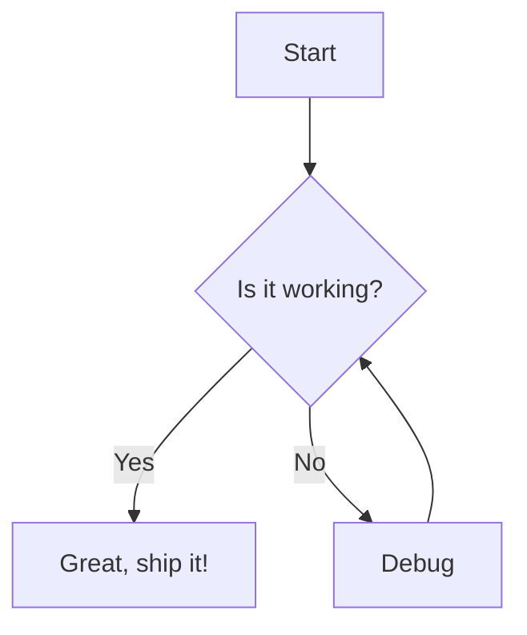
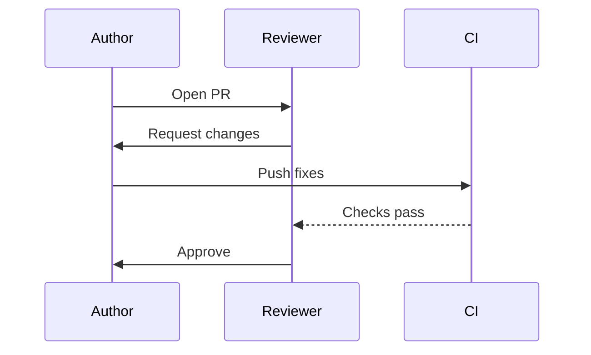
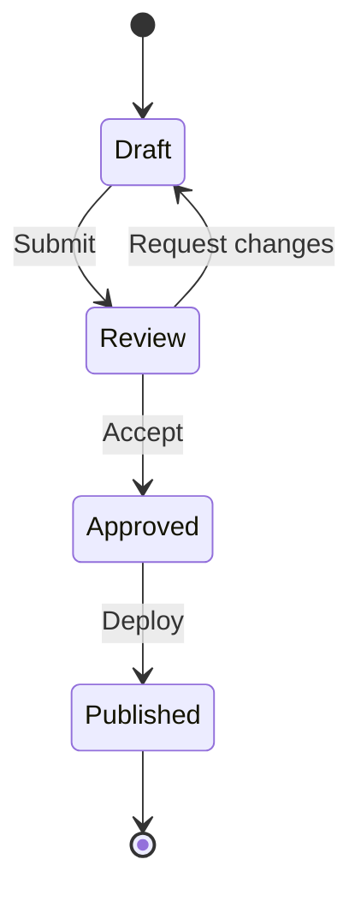

# Slide Mode Basics

This file demonstrates the **happy path** of slide mode in Markdown Presentation Tool. Because it contains `<!-- slide -->` delimiters, each section wrapped in a delimiter pair becomes one slide with full markdown rendering.

For edge cases (preamble handling, empty pairs, tall slides with Shift+scroll), see [03-slide-mode-advanced.md](03-slide-mode-advanced.md).

<!-- slide -->

## Text + Flowchart

Here is a simple decision flow:

- Start with a question
- Follow the branches
- Arrive at an outcome

<!-- slide -->

## Bulleted List + Sequence Diagram

Key participants in the review process:

1. **Author** opens a pull request
2. **Reviewer** examines the changes
3. **CI** runs automated checks
4. **Author** addresses feedback

<!-- slide -->

## Mermaid-Only Slide

A slide can contain only a diagram — no heading, no text.

<!-- slide -->

## Both Mermaid Fence Syntaxes

Backtick fences (GitHub-style) and Azure DevOps triple-colon fences both work:

::: mermaid
graph LR
    A[Markdown File] --> B[getSlides]
    B --> C{Has delimiters?}
    C -->|Yes| D[splitSlides]
    C -->|No| E[extractMermaidBlocks]
    D --> F[Webview]
    E --> F
:::

<!-- slide -->
