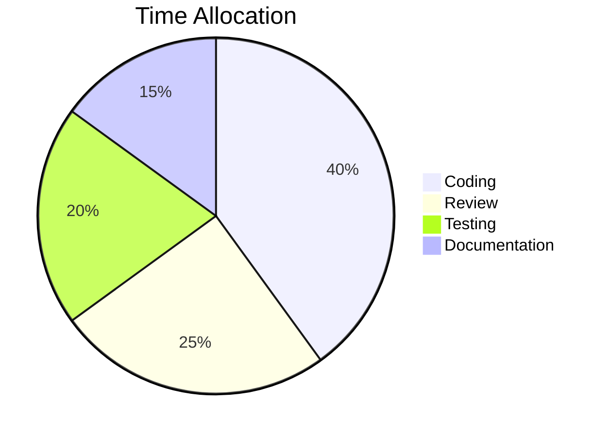

# Slide Mode — Edge Cases

This file exercises the edge cases of slide mode: preamble before the first delimiter, gaps between paired delimiters, empty pairs, tall slides requiring internal scroll, and both Mermaid fence syntaxes.

Everything above the first `<!-- slide -->` is preamble. It stays in the editor but never appears in the slideshow.

<!-- slide -->

## Preamble Is Ignored

Anything before the first `<!-- slide -->` delimiter is discarded when building the slideshow. The text at the very top of this file is an example — you'll see the editor shows it, but this is the first rendered slide.

This lets you keep a file header, table of contents, or draft notes alongside the presentation.

<!-- slide -->

Content between a closing delimiter and the next opening delimiter is also ignored. You can write anything here — meeting notes, scripts, reminders — and it won't leak into the slideshow. Try editing this region while the slideshow is open to confirm.

<!-- slide -->

## Empty Pairs Are Skipped

<!-- slide -->

<!-- slide -->

The two delimiters immediately above this slide form an empty open/close pair. Empty slides are skipped silently so you don't accidentally ship blank slides mid-deck.

<!-- slide -->

## Tall Slide — Shift + Scroll

This slide has enough content to exceed the viewport. Use **Shift + mouse wheel** to scroll within this slide without changing to the next one.

### Section A

Lorem ipsum dolor sit amet, consectetur adipiscing elit. Sed do
eiusmod tempor incididunt ut labore et dolore magna aliqua.



### Section B

> Blockquotes render correctly inside slides. This is useful for
> calling out important information or quoting external sources.

### Section C

Here is some inline code: `const x = 42;` and a code block:

```javascript
function greet(name) {
    return `Hello, ${name}!`;
}
```

### Section D

- Item one with **bold** text
- Item two with *italic* text
- Item three with `inline code`

---

The horizontal rule above is supported because `<!-- slide -->` is
the delimiter (not `---`).

### Section E

More content to ensure this slide requires scrolling in a typical
viewport. The `.slide-content` container should show a scrollbar,
and `Shift + wheel` should scroll vertically within this slide.

<!-- slide -->

## Azure DevOps Syntax

Both Mermaid fence styles work inside slides.

::: mermaid
graph LR
    A[Markdown File] --> B[getSlides]
    B --> C{Has delimiters?}
    C -->|Yes| D[splitSlides]
    C -->|No| E[extractMermaidBlocks]
    D --> F[Webview]
    E --> F
:::

<!-- slide -->

## Trailing Content Is Ignored

The text after the final closing `<!-- slide -->` delimiter won't appear in the slideshow. It's just another form of preamble. Try adding notes here while the presentation is running — nothing will change on screen.
