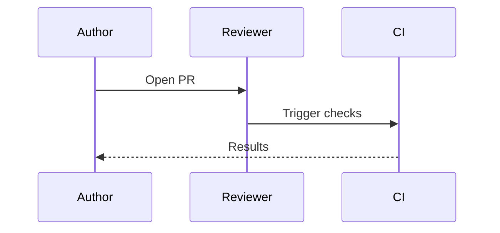
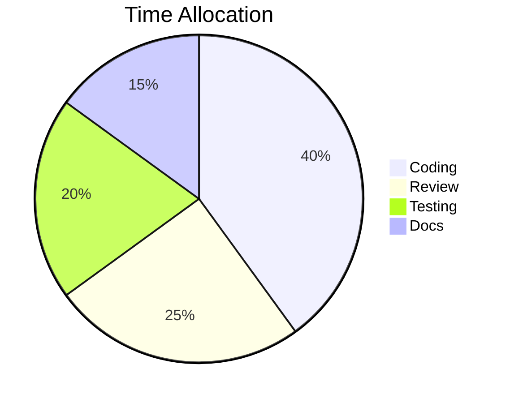

# Demo Script — Full Feature Tour (~3 minutes)

This file is a **recording script**, not an example. During recording, open a fresh blank `.md` file side-by-side with this script and paste each scene's chunk in order. Narrate each scene using the suggested lines.

Scenes are organized by feature. Each scene has: (1) a paste chunk, (2) narration, and (3) an on-camera action.

## Recording checklist

- VS Code window maximized, sidebar collapsed (`Cmd/Ctrl+B`)
- Zoom level 2–3 steps up (`Cmd/Ctrl` + `+`)
- Start with Dark+ theme active; have a Light theme ready for Scene 6
- The existing `examples/01-classic-mode.md` is used as-is in Scene 1 — no editing needed
- Create a new file `demo.md` for Scenes 2–8, starting empty

---

## Scene 1 — Classic (Mermaid-only) mode  `~0:00–0:20`

**On camera:** Open `examples/01-classic-mode.md`. Run `Markdown: Show Markdown Presentation`. Arrow through 2–3 Mermaid diagram slides.

**Narration:** "If your file has Mermaid diagrams and no slide tags, you get one slide per diagram automatically. No setup."

---

## Scene 2 — Add slide tags, see slide mode activate  `~0:20–0:40`

**On camera:** Open blank `demo.md`. Paste Chunk 2. Slideshow now shows full markdown slides.

<!-- chunk: 2 -->
```
<!-- slide -->

# Slide Mode

Wrap content in `<!-- slide -->` tags and the whole markdown file becomes a slideshow.

- Headings, bullets, code, and diagrams all render
- Content outside tags is ignored
- Both are editable side-by-side

<!-- slide -->
```
<!-- /chunk: 2 -->

**Narration:** "Add a single slide tag and the whole behavior changes — now every wrapped section is a full markdown slide."

---

## Scene 3 — Mixed content on one slide  `~0:40–1:00`

**On camera:** Append Chunk 3 to `demo.md`. Navigate to the new slide.

<!-- chunk: 3 -->
```
<!-- slide -->
## Mixed content, one slide

1. **Author** opens a pull request
2. **Reviewer** examines the changes
3. **CI** runs automated checks


<!-- slide -->
```
<!-- /chunk: 3 -->

**Narration:** "A single slide can hold text, ordered lists, bold, and a Mermaid sequence diagram — rendered together."

---

## Scene 4 — Preamble and notes are ignored  `~1:00–1:20`

**On camera:** Add a paragraph at the very top of `demo.md` (before the first `<!-- slide -->`). Type directly — viewers see the content land in the editor but never reach the slideshow.

**Narration:** "Anything outside the slide tags stays in your editor — perfect for speaker notes, a table of contents, or draft ideas. Your audience never sees it."

---

## Scene 5 — Tall slide with Shift+scroll  `~1:20–1:40`

**On camera:** Paste Chunk 5. Navigate to the tall slide. Scroll normally — the slideshow advances. Hold **Shift** and scroll — the slide scrolls internally.

<!-- chunk: 5 -->
```
<!-- slide -->
## Tall slide

Regular scroll moves between slides. **Shift + scroll** moves within this slide.



More content here to force the viewport to overflow...

- Bullet A with enough text to fill width
- Bullet B with enough text to fill width
- Bullet C with enough text to fill width
- Bullet D with enough text to fill width
- Bullet E with enough text to fill width

> A blockquote to add visual variety and push content further down the slide.

```javascript
function scrollDemo() {
    return "Shift + wheel stays on this slide";
}
```

### Section D
More padding content.

### Section E
Even more padding content so we definitely overflow.
<!-- slide -->
```
<!-- /chunk: 5 -->

**Narration:** "Slides taller than the viewport are fine — hold Shift while scrolling to stay on the current slide."

---

## Scene 6 — VS Code theme auto-sync  `~1:40–2:05`

**On camera:** Open the command palette, run `Preferences: Color Theme`, switch from Dark+ to Light+. Watch the slideshow's Mermaid diagrams re-render to match.

**Narration:** "The slideshow follows your editor theme automatically. Switch VS Code to light mode and the diagrams recolor instantly."

---

## Scene 7 — Manual Mermaid theme override  `~2:05–2:25`

**On camera:** Open settings (`Cmd/Ctrl+,`), search `markdownPresentation.mermaid.theme`, change to `forest`. Watch diagrams recolor to the green palette.

**Narration:** "Or pin a specific Mermaid theme — forest, neutral, dark — in the settings."

---

## Scene 8 — Azure DevOps fence syntax  `~2:25–2:45`

**On camera:** Append Chunk 8. Navigate to the new slide.

<!-- chunk: 8 -->
```
<!-- slide -->
## Azure DevOps syntax works too

Same Mermaid, different fence:

::: mermaid
graph LR
    A[Markdown] --> B[Webview]
    B --> C[SVG]
:::
<!-- slide -->
```
<!-- /chunk: 8 -->

**Narration:** "Both GitHub-style triple-backtick and Azure DevOps triple-colon fences are supported, so content works across wikis and repos."

---

## Scene 9 — Closing shot  `~2:45–3:00`

**On camera:** Navigate back to slide 1 with `Home` or left arrow. Let it sit. Cursor in editor, slideshow on the right.

**Narration:** "One markdown file. One click. A complete slide deck — with notes, diagrams, and live updates. Install Markdown Presentation Tool from the VS Code Marketplace."

---

## Post-production

- Target video length: 2:45–3:15
- Export as MP4 for YouTube, generate GIF via `ffmpeg` (`-vf "fps=10,scale=1200:-1"`) for the README
- Save GIF as `assets/demo-long.gif` so README placeholder picks it up
