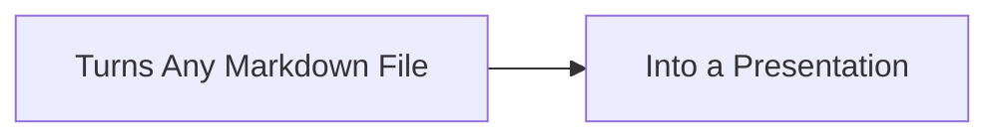
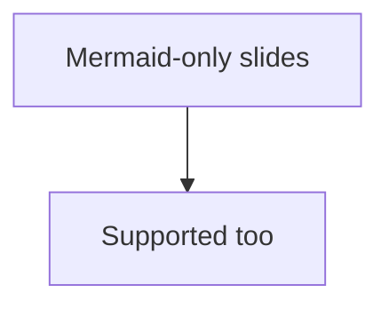

- Action:
    - Start of Presentation Recording
- Annotation against blank editor window.
    - Annotation: Turn any Markdown file into a Slide Show.
    - Annotation: Just like PPT, but for markdown.
- Action:
    - Create test.md and type below text.

---

# Typical Markdown File

- This is a typical markdown file.
- It has some content.
- But it is not a presentation yet.

---

- Action:
    - Click "Open Preview to the Side" and show the preview pane.
    - It says "No slides found. Add `<!-- slide -->` to start a new slide."
- Annotation:
    - To start a new slide, add `<!-- slide -->`.
- Action:
    - Add `<!-- slide -->` tags twice
- Annotation:
    - Wrap content between `<!-- slide -->` tags.
- Action:
    - Add some content between the slide tags.

<!-- slide -->

# This VSCode Extension

<!-- slide -->

---

- Annotation:
    - Content outside slide tags is ignored.

---

# Private Notes

- This content is not visible in the presentation.

- Use it for speaker notes or reminders.

---

- Action:
    - Double click editor tab to make it full screen.
- Annotation:
    - Double-click the editor tab to enter full-screen mode.
- Action:
    - Add all the conent below:

---

<!-- slide -->

# All Markdown Features Supported

- **Bold**
- *Italic*
- `Inline code`

1. Lists
2. Of
3. Items

---

- Horizontal rules

<!-- slide -->

<!-- slide -->

<!-- slide -->

<!-- slide -->

<!-- slide -->

<!-- slide -->

:::mermaid
flowchart TB
  A["Supports both"] --> B["GitHub syntax"]
  A --> C["Azure DevOps syntax"]
:::

<!-- slide -->

---

- Annotation:
    - Images and Mermaid diagrams supported.
    - Navigate with keyboard arrows, mouse scroll, or click.
- Action:
    - Open settings window and show markdownPresentation settings.
- Annotation 6:
    - Many customization options in settings.
    - markdownPresentation.slide
- Action:
    - Change theme Ctrl K + Ctrl T
- Annotation 7:
    - VSCode Light/Dark themes supported.
