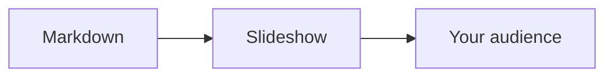
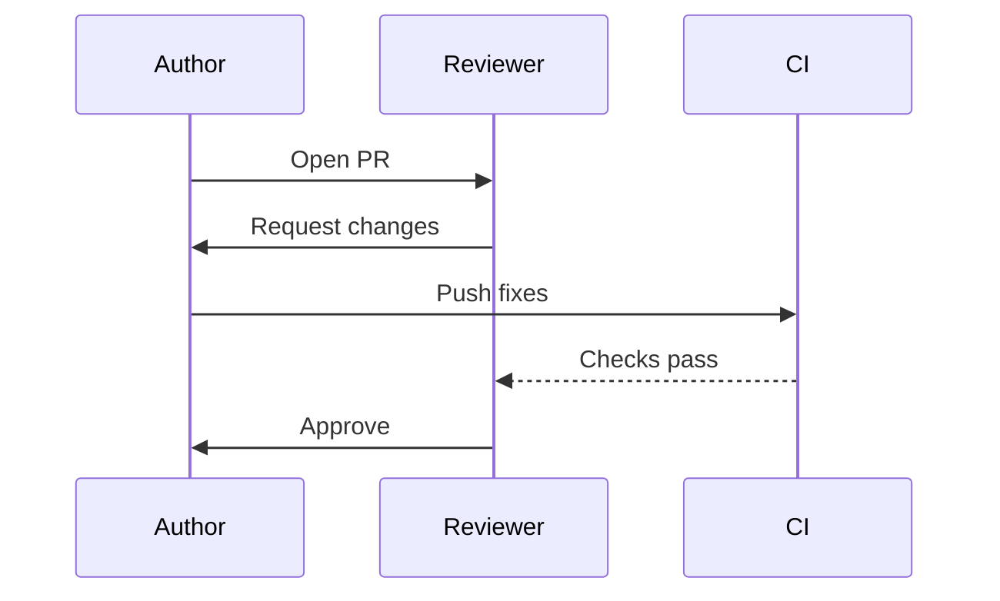

<!-- slide -->

# Markdown Presentation Tool

<!-- slide -->

Turn any markdown file into a slideshow. Just like PPT, but for markdown.

- No new syntax, tools, or learning curve.

- VSCode, Markdown, and Mermaid work as they always do.

- No need to write new content

- Just take existing markdown files and add `<!-- slide -->` tags wherever you want slides.

- Everything between `<!-- slide -->` tags is rendered as a single slide.

<!-- slide -->

## Slide 1: Both text and diagrams

- Full markdown support on every slide — headings, bullets, bold, etc.

- Mermaid diagrams work as usual.

- Live Updates: Changes show up instantly as you edit. No save, no refresh.

<!-- slide -->

# Content outside slide tags is ignored

- This content won't show up in the presentation.

<!-- slide -->

# Navigation: Keyboard, Scroll, or Click

- Use arrow keys, scroll, or click to move through slides.

- Hold down `Shift` for scrolling inside tall slides.

<!-- slide -->

<!-- slide -->

# Themes

- Works natively with your VSCode Light/Dark themes. No extra setup needed.

- Also supports native Mermaid themes for diagrams.
Live updates

<!-- slide -->
