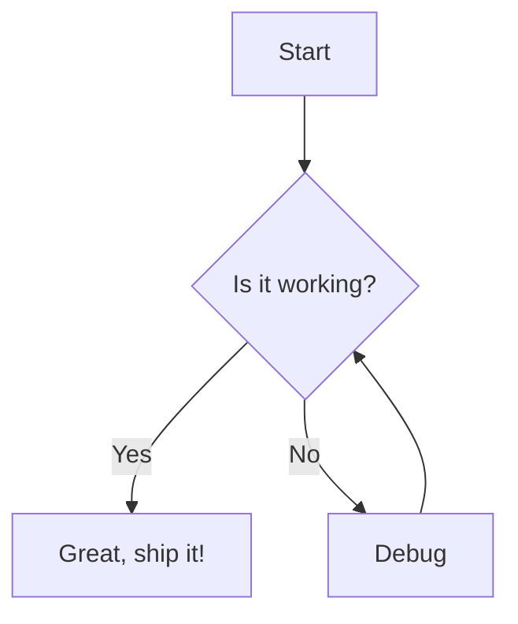
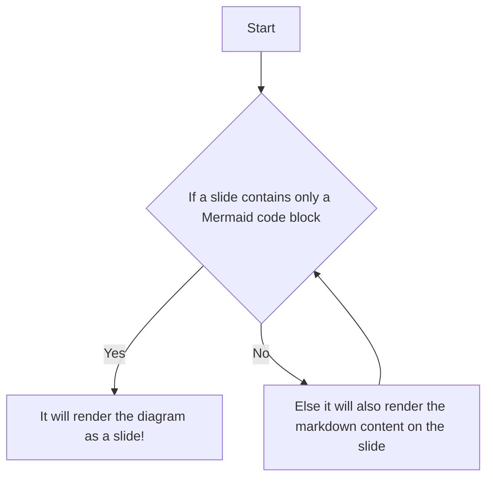
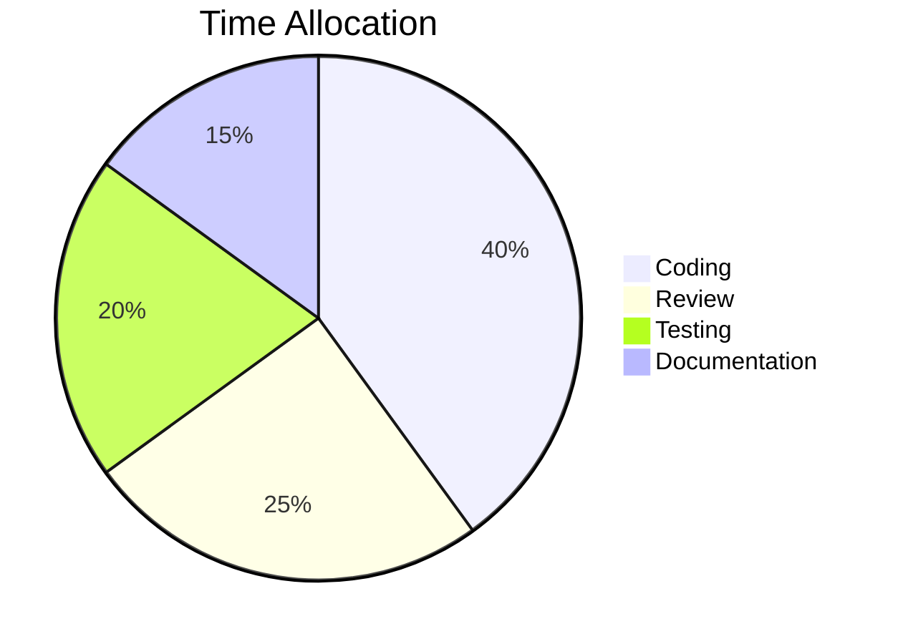
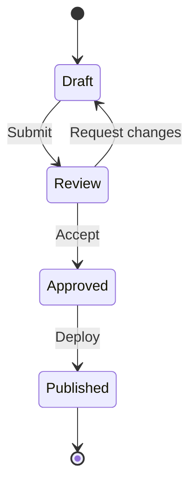

# Slide Mode Demo

This file demonstrates **slide mode** in Markdown Presentation Tool.
Because it contains `<!-- slide -->` delimiters, each section between
delimiters becomes one slide with full markdown rendering.

<!-- slide -->

## Simple Markdown Content

Anything between `<!-- slide -->` delimiters can be visualized as a slide.
Below are some examples of markdown content that render correctly on slides:

### This is a heading

#### Another nested heading

This is a paragraph of text that will appear on the slide. You can include **bold** text, *italic* text, and `inline code` as needed.

- Bullet lists render correctly

1. Numbered lists work too
> Blockquotes are supported as well.

---

Even mermaid diagrams can be included on slides.



<!-- slide -->

## Mermaid Diagrams on Slides

<!-- slide -->



<!-- slide -->

<!-- slide -->
## Tall Slide (Scroll Test)

If your slide has a lot of content, then **holding Shift while scrolling** will scroll within the current slide instead of changing to the next one. This allows you to have slides that exceed the viewport height without losing the ability to navigate through them.

### Section A

Lorem ipsum dolor sit amet, consectetur adipiscing elit. Sed do
eiusmod tempor incididunt ut labore et dolore magna aliqua.





### Section B

> Blockquotes render correctly inside slides. This is useful for
> calling out important information or quoting external sources.

### Section C

Here is some inline code: `const x = 42;` and a code block:

```javascript
function greet(name) {
    return `Hello, ${name}!`;
}
```

### Section D

- Item one with **bold** text
- Item two with *italic* text
- Item three with `inline code`

---

The horizontal rule above is supported because `<!-- slide -->` is
the delimiter (not `---`).

### Section E

More content to ensure this slide requires scrolling in a typical
viewport. The `.slide-content` container should show a scrollbar,
and `Shift + wheel` should scroll vertically within this slide.

<!-- slide -->

## Content outside of slides

Any content outside of `<!-- slide -->` delimiters is ignored for slideshow purposes. It will still show up in the markdown editor or preview, but it won't be part of the presentation. This allows you to maintain detailed notes or documentation in the same file without affecting the slideshow experience.



<!-- slide -->
## Azure DevOps Syntax is also supported on slides

Azure DevOps syntax for Mermaid diagrams in addition to regular Github-style fenced code blocks.
Below is an example of a Mermaid diagram using Azure DevOps syntax:

::: mermaid
graph LR
    A[Markdown File] --> B[getSlides]
    B --> C{Has delimiters?}
    C -->|Yes| D[splitSlides]
    C -->|No| E[extractMermaidBlocks]
    D --> F[Webview]
    E --> F
:::
<!-- slide -->
