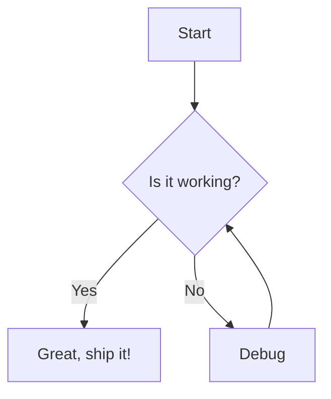
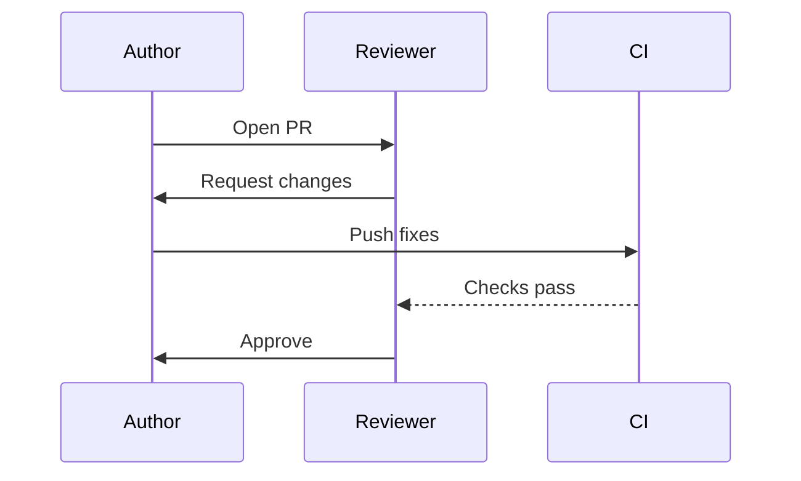
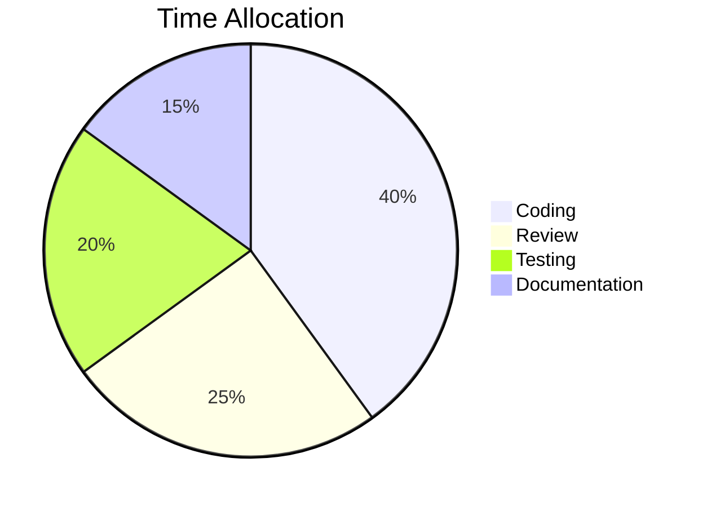
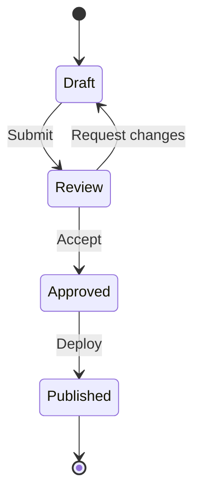

# Slide Mode Demo

This file demonstrates **slide mode** in Markdown Slideshow.
Because it contains `<!-- slide -->` delimiters, each section between
delimiters becomes one slide with full markdown rendering.

<!-- slide -->

## Text + Flowchart

Here is a simple decision flow:

- Start with a question
- Follow the branches
- Arrive at an outcome



<!-- slide -->

## Bulleted List + Sequence Diagram

Key participants in the review process:

1. **Author** opens a pull request
2. **Reviewer** examines the changes
3. **CI** runs automated checks
4. **Author** addresses feedback



<!-- slide -->

## Tall Slide (Scroll Test)

This slide has enough content to exceed the viewport height.
Use **Shift + mouse wheel** to scroll within this slide without
changing to the next one.

### Section A

Lorem ipsum dolor sit amet, consectetur adipiscing elit. Sed do
eiusmod tempor incididunt ut labore et dolore magna aliqua.





### Section B

> Blockquotes render correctly inside slides. This is useful for
> calling out important information or quoting external sources.

### Section C

Here is some inline code: `const x = 42;` and a code block:

```javascript
function greet(name) {
    return `Hello, ${name}!`;
}
```

### Section D

- Item one with **bold** text
- Item two with *italic* text
- Item three with `inline code`

---

The horizontal rule above is supported because `<!-- slide -->` is
the delimiter (not `---`).

### Section E

More content to ensure this slide requires scrolling in a typical
viewport. The `.slide-content` container should show a scrollbar,
and `Shift + wheel` should scroll vertically within this slide.

<!-- slide -->

## Mermaid-Only Slide



<!-- slide -->

## Azure DevOps Syntax

Both Mermaid fence styles work inside slides:

::: mermaid
graph LR
    A[Markdown File] --> B[getSlides]
    B --> C{Has delimiters?}
    C -->|Yes| D[splitSlides]
    C -->|No| E[extractMermaidBlocks]
    D --> F[Webview]
    E --> F
:::
