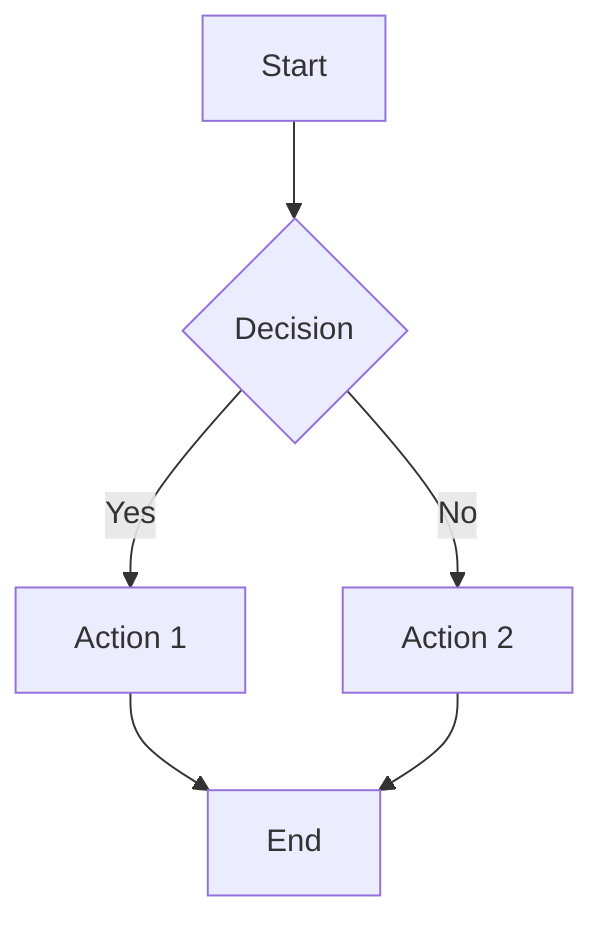
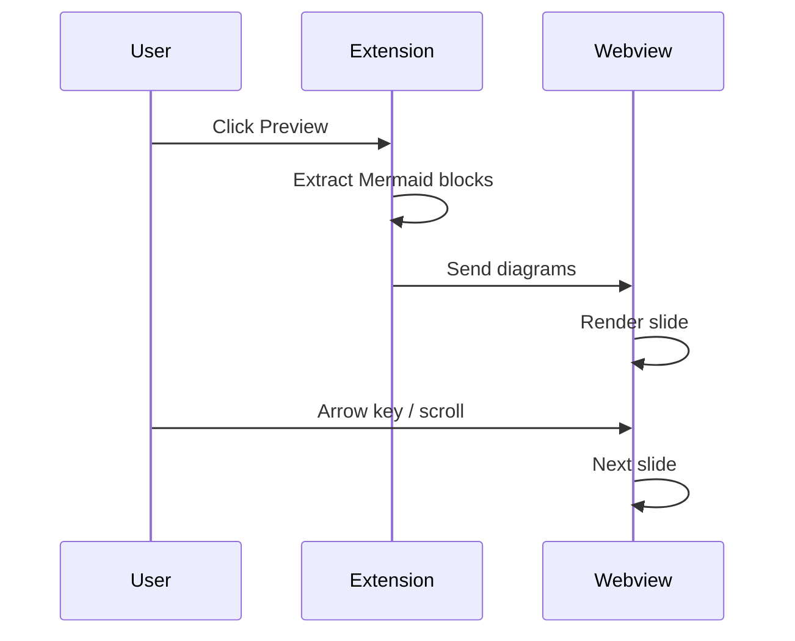
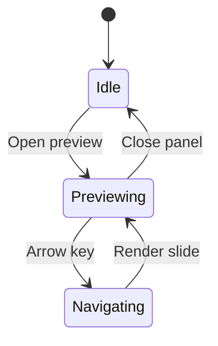
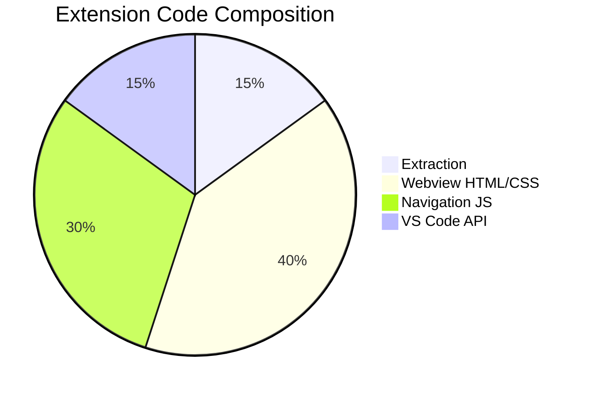

# Mermaid Slideshow Test File

This file contains 5 Mermaid diagrams for testing the slideshow preview.

## Diagram 1: Flowchart



## Diagram 2: Sequence Diagram



## Diagram 3: State Diagram



## Diagram 4: Pie Chart



## Diagram 5: Azure DevOps Syntax

::: mermaid
graph LR
    A[Markdown File] --> B[Extract Blocks]
    B --> C[Slideshow]
    C --> D[Navigate]
:::

## Non-Mermaid Content

This paragraph and the code block below should be ignored by the extraction engine.

```javascript
console.log("This is not a mermaid diagram");
```
