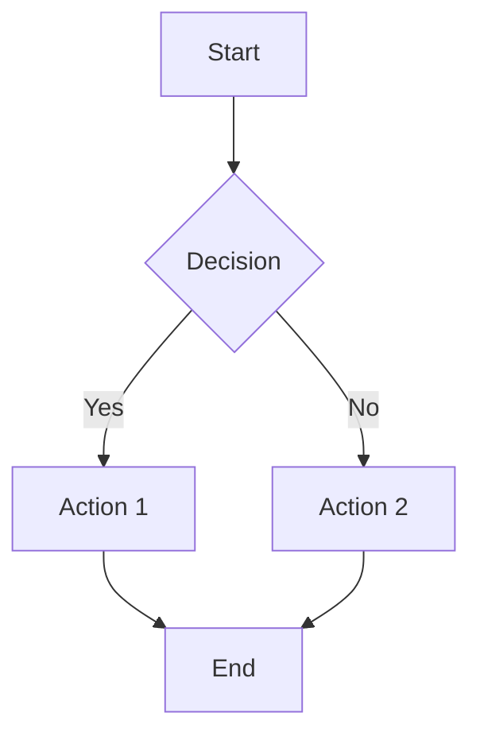
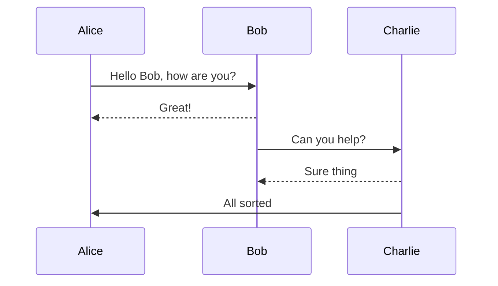
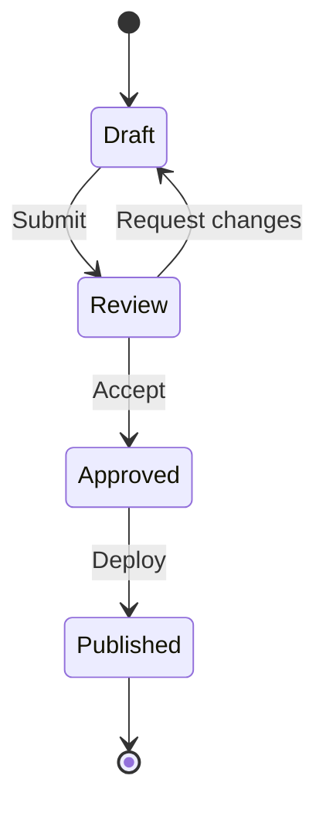
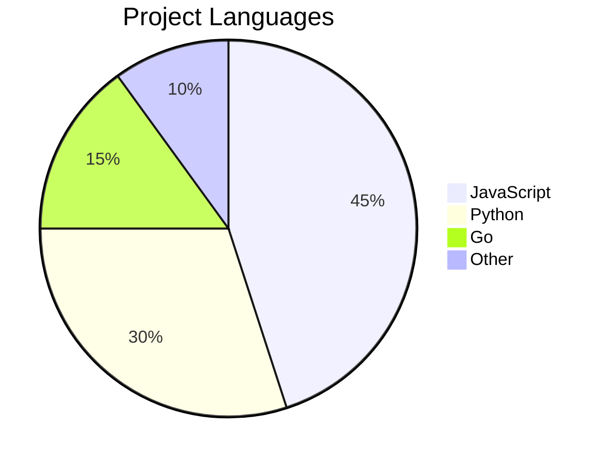
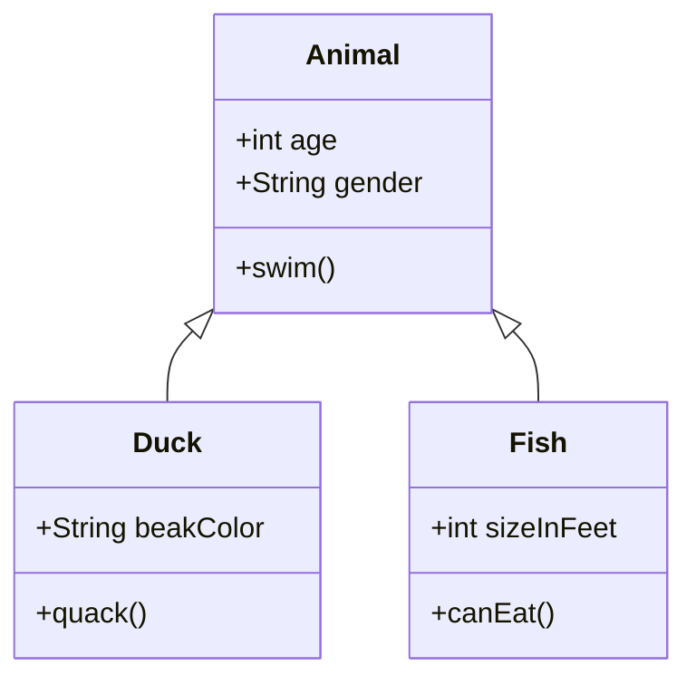
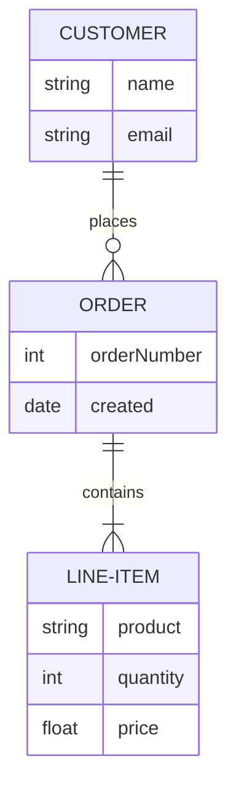
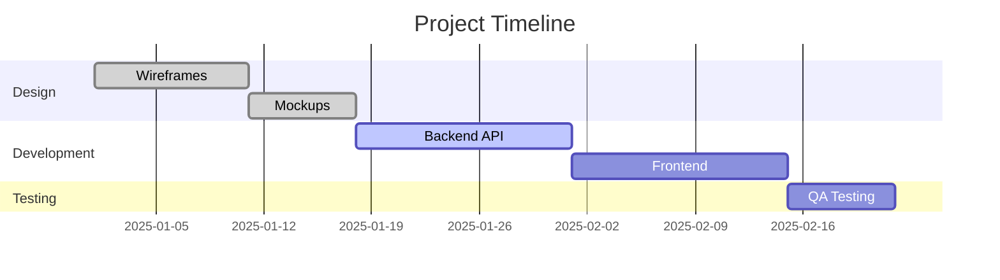
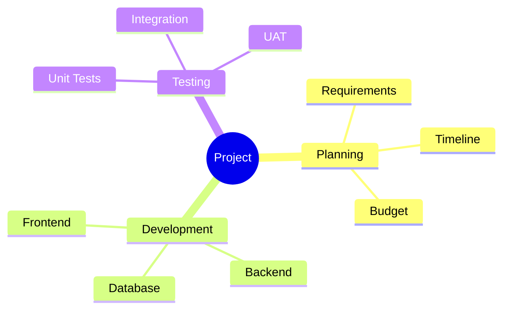

# Mermaid Slideshow

This file contains diverse content types for testing slideshow rendering and navigation.
It demonstrates Mermaid diagrams, image slides, and markdown content slides.

## About This Extension

- Markdown preview extensions show your whole file.

- But what if you want to focus just on the Mermaid diagrams?

- Mermaid Slideshow (this extension) presents every diagram from your markdown file.

- Make a presentation directly from your markdown notes. No extra setup, no exports.

- One diagram at a time. As a slideshow.

- Extremely lightweight and works with all Mermaid syntax.

- Works with all native Mermaid themes.

- Supports VSCode Dark and Light themes.

- Use the Zen Mode for distraction-free presenting.

- **NEW:** Also supports image slides and markdown content slides!

---

## Diagram 1: Flowchart

- The diagram below shows a simple flowchart with decision points and actions.
- Note that this text will not appear in the slideshow; only the diagram will be presented.
- This means you can have the same markdown file for both detailed editing and focused presenting, without needing to maintain separate files.


```mermaid
graph TD
    A[Start] --> B{Decision}
    B -->|Yes| C[Action 1]
    B -->|No| D[Action 2]
    C --> E[End]
    D --> E
```

- The test block below the Mermaid code block ensures that the slideshow correctly identifies and presents only the Mermaid code blocks, ignoring regular text and other surrounding content.

## Diagram 2: Sequence Diagram


```mermaid
sequenceDiagram
    participant Alice
    participant Bob
    participant Charlie
    Alice->>Bob: Hello Bob, how are you?
    Bob-->>Alice: Great!
    Bob->>Charlie: Can you help?
    Charlie-->>Bob: Sure thing
    Charlie->>Alice: All sorted
```

- This is another block of text to confirm that only Mermaid diagrams are presented in the slideshow.

---

## Image Slides

These images test different aspect ratios and sizes. Each image becomes its own slide, centered and scaled to fit without distortion.

### Large Landscape Image (2560×1707)


### Small Landscape Image (320×213)


### Portrait Image (505×636)


### Tall Portrait Image (673×1024)


---

## Markdown Slide: Bullet Points and Lists

This section demonstrates markdown rendering as a presentation slide.

### Unordered List

- First item
- Second item with **bold text**
- Third item with `inline code`
  - Nested item A
  - Nested item B
    - Deeply nested

### Ordered List

1. Step one
2. Step two
3. Step three
   1. Sub-step 3a
   2. Sub-step 3b

---

## Markdown Slide: Code Blocks and Formatting

### JavaScript Example

```javascript
function greet(name) {
    return `Hello, ${name}!`;
}

console.log(greet("World"));
```

### Python Example

```python
def fibonacci(n):
    a, b = 0, 1
    for _ in range(n):
        yield a
        a, b = b, a + b

print(list(fibonacci(10)))
```

### Blockquote

> "The best way to predict the future is to invent it."
> — Alan Kay

---

## Markdown Slide: Tables

| Feature | Status | Notes |
|---|---|---|
| Mermaid diagrams | ✅ Supported | All diagram types |
| Image slides | ✅ Supported | Any aspect ratio |
| Markdown slides | ✅ Supported | Full formatting |
| Navigation | ✅ Supported | Keyboard, mouse, arrows |
| Live updates | ✅ Supported | Debounced 300ms |

---

## Diagram 3: State Diagram


```mermaid
stateDiagram-v2
    [*] --> Draft
    Draft --> Review: Submit
    Review --> Approved: Accept
    Review --> Draft: Request changes
    Approved --> Published: Deploy
    Published --> [*]
```

## Diagram 4: Pie Chart


```mermaid
pie title Project Languages
    "JavaScript" : 45
    "Python" : 30
    "Go" : 15
    "Other" : 10
```

## Diagram 5: Azure DevOps Syntax

- Mermaid also supports Azure DevOps syntax for diagrams, which is a common use case for many users.

::: mermaid
graph LR
A[Markdown File] --> B[Extract Blocks]
B --> C[Slideshow]
C --> D[Navigate]
:::

---

## Diagram 6: Class Diagram


```mermaid
classDiagram
    Animal <|-- Duck
    Animal <|-- Fish
    Animal : +int age
    Animal : +String gender
    Animal : +swim()
    Duck : +String beakColor
    Duck : +quack()
    Fish : +int sizeInFeet
    Fish : +canEat()
```

## Diagram 7: Entity-Relationship Diagram


```mermaid
erDiagram
    CUSTOMER ||--o{ ORDER : places
    ORDER ||--|{ LINE-ITEM : contains
    CUSTOMER {
        string name
        string email
    }
    ORDER {
        int orderNumber
        date created
    }
    LINE-ITEM {
        string product
        int quantity
        float price
    }
```

## Diagram 8: Gantt Chart


```mermaid
gantt
    title Project Timeline
    dateFormat YYYY-MM-DD
    section Design
        Wireframes     :done, d1, 2025-01-01, 10d
        Mockups        :done, d2, after d1, 7d
    section Development
        Backend API    :active, dev1, 2025-01-18, 14d
        Frontend       :dev2, after dev1, 14d
    section Testing
        QA Testing     :test1, after dev2, 7d
```

## Diagram 9: Mindmap


```mermaid
mindmap
    root((Project))
        Planning
            Requirements
            Timeline
            Budget
        Development
            Frontend
            Backend
            Database
        Testing
            Unit Tests
            Integration
            UAT
```

---

## Non-Mermaid Content

This paragraph and the code block below should be ignored by the extraction engine when image and markdown slides are disabled.

```javascript
console.log("This is not a mermaid diagram");
```
