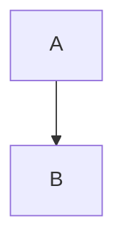

# Mermaid Slideshow

A VS Code extension that turns Mermaid diagrams into a distraction-free slideshow.

Each diagram gets its own full-panel slide - no surrounding markdown, no tiny inline renders, no clutter.


## Why This Extension?

VS Code's built-in markdown preview renders diagrams inline alongside text - small, non-interactive, and buried in content. Mermaid Slideshow pulls your diagrams out and presents each one full-screen, so you can actually read them.

- **Review architecture docs** - step through complex diagrams one at a time without scrolling past walls of text
- **Present in meetings** - navigate with arrow keys or mouse scroll like a slide deck, right inside VS Code
- **Iterate on diagrams** - live preview updates instantly as you edit the source, keeping you in flow
- **Both syntaxes supported** - GitHub-style (```) and Azure DevOps-style (:::) Mermaid blocks
- **Secure** - Content Security Policy with nonce-based script execution, no user HTML passthrough

## Install

1. Open VS Code (or any VS Code-based editor)
2. Go to Extensions
3. Search for "Mermaid Slideshow" or `KunalPathak.mermaid-slideshow`
4. Click Install

## Usage

1. Open any markdown file containing Mermaid diagram blocks
2. Click the presentation icon in the editor title bar (or use Command Palette: `Mermaid: Show Mermaid Slideshow`)
3. Navigate slides with:
   - Left/Right arrow keys
   - Up/Down arrow keys
   - Mouse scroll wheel
   - Click the `‹` `›` navigation arrows

The slide counter in the bottom-right shows your position (e.g., "2 / 5").

## Configuration

Open VS Code Settings (`Cmd+,` on macOS, `Ctrl+,` on Windows/Linux) and search for **"Mermaid Slideshow"**.

| Setting | Options | Default | Description |
|---|---|---|---|
| `mermaidSlideshow.theme` | `default`, `dark`, `forest`, `neutral` | `default` | Color theme for rendered diagrams |

**Themes:**

- **default** - Clean and simple
- **dark** - Dark background with light text, matches dark VS Code themes
- **forest** - Green-toned, nature-inspired palette
- **neutral** - Grayscale, high-contrast, print-friendly

Changing the theme takes effect immediately on the open slideshow.

## Supported Syntax

GitHub/CommonMark style:

````markdown

````

Azure DevOps style:

```markdown
::: mermaid
graph TD
    A --> B
:::
```

Both syntaxes are extracted and rendered identically.

## For Developers

- [architecture.md](docs/architecture.md) - Design decisions and security model
- [development.md](docs/development.md) - Setup, workflow, and release process
- [CHANGELOG.md](CHANGELOG.md) - Version history
