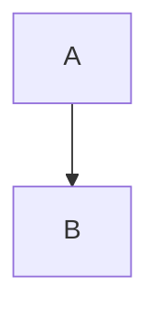

# Mermaid Slides Preview

A VS Code extension that extracts Mermaid diagrams from markdown files and presents them as a navigable slideshow.

## Why This Extension?

- **Focused:** Shows only Mermaid diagrams — no markdown rendering clutter
- **Slideshow:** One diagram per slide, full-panel, centered
- **Navigate:** Arrow keys, mouse scroll, or click the nav arrows
- **Live Updates:** Edit your markdown and the preview updates instantly
- **Universal Mermaid:** Supports both GitHub-style (```) and Azure DevOps-style (:::) syntax
- **Secure:** Content Security Policy with nonce-based script execution
- **Zero Configuration:** Install and use. No settings, no plugins.

## Install

1. Open VS Code (or any VS Code-based editor)
2. Go to Extensions
3. Search for "Mermaid Slides Preview" or `KunalPathak.mermaid-slides-preview`
4. Click Install

## Usage

1. Open any markdown file containing Mermaid diagram blocks
2. Click the presentation icon in the editor title bar (or use Command Palette: `Mermaid: Show Mermaid Slides Preview`)
3. Navigate slides with:
   - Left/Right arrow keys
   - Up/Down arrow keys
   - Mouse scroll wheel
   - Click the `‹` `›` navigation arrows

The slide counter in the bottom-right shows your position (e.g., "2 / 5").

## Supported Syntax

GitHub/CommonMark style:

````markdown

````

Azure DevOps style:

```markdown
::: mermaid
graph TD
    A --> B
:::
```

Both syntaxes are extracted and rendered identically.

## For Developers

- [architecture.md](docs/architecture.md) — Design decisions and security model
- [development.md](docs/development.md) — Setup, workflow, and release process
- [CHANGELOG.md](CHANGELOG.md) — Version history
