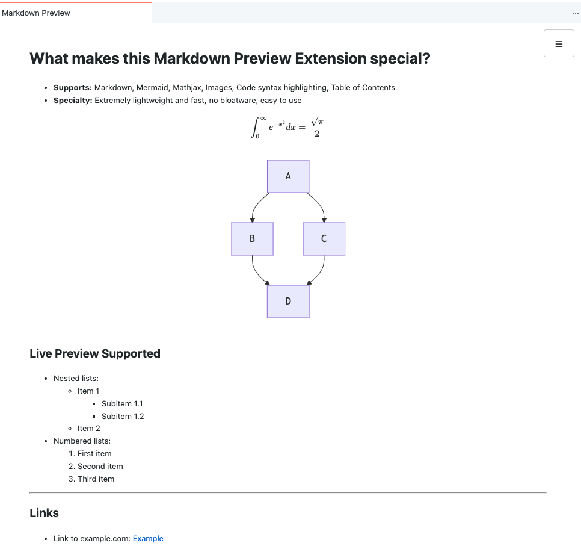

# Lightweight Markdown Preview

A minimal VS Code extension for previewing Markdown with Mermaid diagrams and MathJax support. **No bloat. No configuration. Just markdown.**

## Why This Extension?

- **Lightest:** The smallest full-featured markdown preview extension available
- **Fastest:** Instant live preview updates as you type
- **Universal Mermaid:** Renders both GitHub-style (```) and Azure DevOps-style (:::) diagrams
- **Privacy-Friendly:** No tracking, no analytics, no data collection
- **Secure:** Content Security Policy with nonce-based script execution
- **Zero Configuration:** Install and use. No themes, no plugins, no bloat.



## Features

- Real-time Markdown preview in a side panel
- Collapsible table of contents sidebar with heading-level indicators (#, ##, ###) for clear hierarchy
- Auto-scrolling outline that highlights your current section as you read and auto-expands collapsed sections
- Click-to-scroll navigation in the TOC for quick jumping between sections
- All standard Markdown elements (headings, lists, tables, code blocks, images, etc.)
- Full Mermaid diagram support with dual syntax compatibility:
  - GitHub/CommonMark style: ` ```mermaid `
  - Azure DevOps style: `::: mermaid`
- MathJax support for LaTeX equations

### Azure DevOps Compatibility

Azure DevOps uses triple-colon (:::) "Fenced Div" syntax for Mermaid diagrams, while GitHub and most tools use backticks (```). This creates a portability problem—diagrams that render in your IDE or GitHub break in Azure Repos and Wikis.

**This extension solves it.** Both syntaxes render identically, making your documentation portable across platforms without manual conversion.

## Install

1. Open VS Code (Insiders, Cursor, Windsurf or any other VS Code-based editor)
2. Go to Extensions
3. Search for "Lightweight Markdown Preview" or explicitly for `KunalPathak.lightweight-markdown-preview`
4. Click Install
5. Start previewing your Markdown file by clicking the "Eye" icon in the top-right corner or using the Command Palette (`Ctrl+Shift+P` > `Markdown: Show Lightweight Markdown Preview`)

## Documentation Guide

### For Users
This README is all you need to install and use the extension.

### For Developers

**Before making any code changes:**
1. Read [architecture.md](docs/architecture.md) - understand design decisions, security model, and why things are structured as they are
2. This ensures changes align with the existing design and don't introduce security issues

**While developing and releasing:**
1. Follow [development.md](docs/development.md) for the complete workflow:
   - **Section 1:** Local setup and verification
   - **Section 2:** Feature development workflow (creating branches, making changes, testing, merging)
   - **Section 3:** Release to marketplace (version bumps, tagging, publishing)
   - **Section 4-5:** Code quality checklist and common pitfalls
   - **Section 6-7:** Troubleshooting and release checklist

**At a glance:**
- `architecture.md` - WHY design decisions were made
- `development.md` - HOW to develop and release code
- `CHANGELOG.md` - WHAT changed in each version
