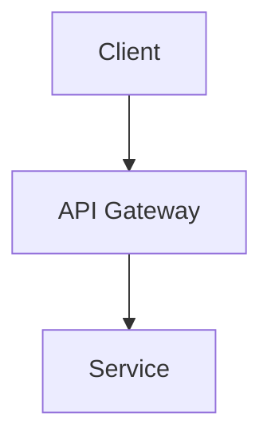

# Markdown Slideshow

A VS Code extension that turns your markdown files into a navigable slideshow — right in the editor.

Write your notes, documentation, or presentation in plain markdown. Open the slideshow preview, and each section becomes a slide you can click or keyboard through. Mermaid diagrams render inline. Live updates as you type.

## Getting Started

1. Install **Markdown Slideshow** from the [VS Code Marketplace](https://marketplace.visualstudio.com/items?itemName=KunalPathak.markdown-slideshow).
2. Open any `.md` file.
3. Run **Markdown: Show Markdown Slideshow** from the Command Palette (`Cmd+Shift+P` / `Ctrl+Shift+P`), or click the slideshow icon in the editor title bar.
4. The slideshow opens in a side panel and updates live as you edit.

## How It Works

The extension has two modes, auto-detected per file:

### Classic Mode

If your file has Mermaid code blocks but no slide delimiters, each Mermaid diagram becomes its own slide. This is the simplest way to present diagrams from your notes — no extra markup needed.

### Slide Mode

Add `<!-- slide -->` HTML comments on their own line to divide your file into sections. Each section becomes one slide with full markdown rendering:

````markdown
# Welcome

This is the first slide.

<!-- slide -->

## Architecture

A text paragraph followed by a diagram:


```mermaid
graph TD
    A[Client] --> B[API Gateway]
    B --> C[Service]
```

<!-- slide -->

## Key Points

- Bullet lists render correctly
- So does **bold**, *italic*, and `inline code`
- Blockquotes, headings, horizontal rules, and code blocks too

> This is a blockquote on a slide.
````

The delimiter is case-insensitive (`<!-- SLIDE -->` also works). Delimiters inside fenced code blocks are ignored. YAML front matter at the top of the file is automatically stripped.

## Navigation

| Action | Controls |
|---|---|
| Next slide | Right arrow, Down arrow, PageDown, Space, scroll down |
| Previous slide | Left arrow, Up arrow, PageUp, scroll up |
| Scroll within a tall slide | **Shift** + scroll |
| Click navigation | Arrow buttons on the left and right edges |

When a slide is taller than the viewport, hold **Shift** while scrolling to move within the current slide without changing slides.

## Mermaid Diagrams

Both standard and Azure DevOps Mermaid syntaxes are supported:

````markdown

```mermaid
graph TD
    A --> B
```

::: mermaid
graph TD
    A --> B
:::
````

The Mermaid theme auto-detects from your VS Code color theme (dark themes get the Mermaid dark theme, light themes get the default). You can override this in settings.

## Settings

| Setting | Description | Default |
|---|---|---|
| `markdownSlideshow.theme` | Mermaid color theme: `default`, `dark`, `forest`, `neutral` | `default` (auto-detects from VS Code theme) |

## Contributing

See [docs/development.md](docs/development.md) for local setup, testing, CI, and release instructions.

## License

[MIT](LICENSE)
