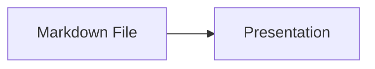

# Markdown Presentation & Slideshow for VS Code

**Turn your Markdown files into interactive slide decks instantly.**

**Present your documents directly from VS Code—just like PowerPoint, but powered by the simplicity of plain text.**

[Markdown Presentation Tool](https://marketplace.visualstudio.com/items?itemName=KunalPathak.markdown-presentation-tool) is a lightweight extension designed to present documentation, meeting notes, or architecture diagrams without the friction of external software.

Stop wasting time exporting to PDF or building clunky PPT files. Write your content in Markdown and launch a beautiful, navigable slideshow with a single click.


## Key Features

- **Native VS Code Integration:** Plugs directly into your existing workflow.
- **Zero Configuration:** Works just like the built-in Markdown preview. Simply click the presentation icon and go.
- **Real-Time Live Sync:** Editor changes reflect instantly in the slideshow view.
- **Full Markdown Support:** Headings, lists, blockquotes, and code blocks render perfectly.
- **Rich Media & Diagrams:** Full support for Mermaid.js diagrams and remote images.
- **Customizable Styles:** Control alignment, font size, and background colors to suit your brand.
- **Theme Awareness:** Automatically syncs with your VS Code theme (Light/Dark) for a seamless look.
- **Clean Document Structure:** Uses `<!-- slide -->` tags that remain invisible in standard Markdown previews, keeping your source files clean.

## Getting Started

1. **Install** the extension from the [VS Code Marketplace](https://marketplace.visualstudio.com/items?itemName=KunalPathak.markdown-presentation-tool).
2. **Open** any Markdown (`.md`) file.
3. **Launch the Presentation:**
   - Click the **Presentation Icon** in the editor title bar (top right).
   - **OR** open the Command Palette (`Cmd+Shift+P` / `Ctrl+Shift+P`) and type `Markdown: Show Markdown Presentation`.

## Navigation & Controls


| Action              | Input                                                            |
| :------------------ | :--------------------------------------------------------------- |
| **Next Slide**      | `Right Arrow`, `Down Arrow`, `PageDown`, `Space`, or Scroll Down |
| **Previous Slide**  | `Left Arrow`, `Up Arrow`, `PageUp`, or Scroll Up                 |
| **Internal Scroll** | `Shift` + `Scroll` (for long slides)                             |
| **Visual Navigation**| Interactive arrow overlays on screen edges                       |

## Configuration Reference

Adjust these in VS Code Settings (`Cmd+,` / `Ctrl+,`) under **Markdown Presentation Tool**.


| Category       | Setting                                           | Default   | Description                                           |
| :------------- | :------------------------------------------------ | :-------- | :---------------------------------------------------- |
| **Mermaid**    | `markdownPresentation.slide.mermaidTheme`         | `default` | `default` (auto), `dark`, `forest`, or `neutral`      |
| **Appearance** | `markdownPresentation.slide.headingAlignment`     | `left`    | `left`, `center`, or `right`                          |
| **Appearance** | `markdownPresentation.slide.contentAlignment`     | `left`    | `left`, `center`, or `right`                          |
| **Appearance** | `markdownPresentation.slide.fontSize`             | `medium`  | `small` (0.85em), `medium` (1em), or `large` (1.25em) |
| **Appearance** | `markdownPresentation.slide.backgroundColor`      | _(empty)_ | Custom hex code (e.g., `#1e1e1e`)                     |
| **UI**         | `markdownPresentation.slide.showCounter`          | `true`    | Toggle the slide counter (bottom-right)               |
| **UI**         | `markdownPresentation.slide.showNavigationArrows` | `true`    | Toggle the on-screen navigation arrows                |

## How to Create Slides

Defining a slide is simple. Separate your content using the `<!-- slide -->` comment tag.

````markdown
<!-- slide -->

# My First Slide

Welcome to the presentation!

<!-- slide -->

# Private Notes

- Content outside of slide tags is not shown during the presentation.

<!-- slide -->

# Mermaid Diagrams Also Work Natively


```mermaid
graph LR
    A[Markdown File] --> B[Presentation]
```

- Images from the web work too!

<!-- slide -->
````
## Contributing & Support

- **Contributions:** We welcome your help! See our [Development Guide](/docs/development.md) for local setup instructions.
- **Codebase:** Check out the [Architecture Guide](/docs/architecture.md) to understand the project structure and design.
