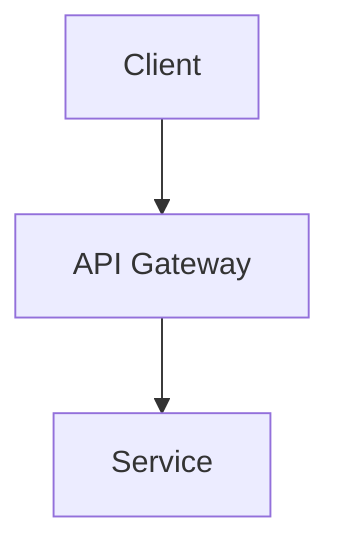

# Markdown Slideshow

A VS Code extension that turns your markdown files into a navigable slideshow — right in the editor.

Write your notes, documentation, or presentation in plain markdown. Wrap sections in `<!-- slide -->` delimiters, open the preview, and each section becomes a slide you can click or keyboard through. Mermaid diagrams render inline. Live updates as you type.

## Getting Started

1. Install **Markdown Slideshow** from the [VS Code Marketplace](https://marketplace.visualstudio.com/items?itemName=KunalPathak.markdown-slideshow).
2. Open any `.md` file.
3. Run **Markdown: Show Markdown Slideshow** from the Command Palette (`Cmd+Shift+P` / `Ctrl+Shift+P`), or click the slideshow icon in the editor title bar.
4. The slideshow opens in a side panel and updates live as you edit.

## Creating Slides

Add `<!-- slide -->` HTML comments to mark the start and end of each slide, just like code fences:

````markdown
# My Document

These are my working notes. This text is not part of the slideshow.

<!-- slide -->

## Introduction

This is the first slide. It supports **bold**, *italic*, `inline code`,
lists, blockquotes, headings, horizontal rules, and code blocks.

<!-- slide -->

Some more notes here that won't appear in the slideshow.

<!-- slide -->

## Architecture

A diagram with surrounding text — all on one slide:


```mermaid
graph TD
    A[Client] --> B[API Gateway]
    B --> C[Service]
```

<!-- slide -->

<!-- slide -->

## Key Points

- Bullet lists render correctly
- So does **bold**, *italic*, and `inline code`

> This is a blockquote on a slide.

<!-- slide -->
````

**How it works:**

- The 1st `<!-- slide -->` opens a slide, the 2nd closes it, the 3rd opens the next, and so on — just like opening and closing code fences.
- Content outside any open/close pair (preamble, notes between slides, trailing text) is ignored. This lets you keep detailed notes in the same file without them appearing in the presentation.
- If a slide is left unclosed (odd number of delimiters), it is implicitly closed at the end of the file.
- Empty slides (open immediately followed by close) are skipped.
- The delimiter is case-insensitive (`<!-- SLIDE -->` also works).
- Delimiters inside fenced code blocks are ignored.
- YAML front matter at the top of the file is automatically stripped.

## Mermaid Diagrams

Mermaid diagrams render on any slide. Both standard and Azure DevOps syntaxes are supported:

````markdown

```mermaid
graph TD
    A --> B
```

::: mermaid
graph TD
    A --> B
:::
````

**Files without `<!-- slide -->` delimiters:** If your file has Mermaid code blocks but no slide delimiters, each Mermaid diagram is automatically shown as its own slide. This is a convenient shortcut for diagram-heavy files that don't need surrounding text in the presentation.

The Mermaid theme auto-detects from your VS Code color theme (dark themes get the Mermaid dark theme, light themes get the default). You can override this in settings.

## Navigation

| Action | Controls |
|---|---|
| Next slide | Right arrow, Down arrow, PageDown, Space, scroll down |
| Previous slide | Left arrow, Up arrow, PageUp, scroll up |
| Scroll within a tall slide | **Shift** + scroll |
| Click navigation | Arrow buttons on the left and right edges |

When a slide is taller than the viewport, hold **Shift** while scrolling to move within the current slide without changing slides.

## Settings

| Setting | Description | Default |
|---|---|---|
| `markdownSlideshow.theme` | Mermaid color theme: `default`, `dark`, `forest`, `neutral` | `default` (auto-detects from VS Code theme) |

## Contributing

See [docs/development.md](docs/development.md) for local setup, testing, CI, and release instructions.

## License

[MIT](LICENSE)
